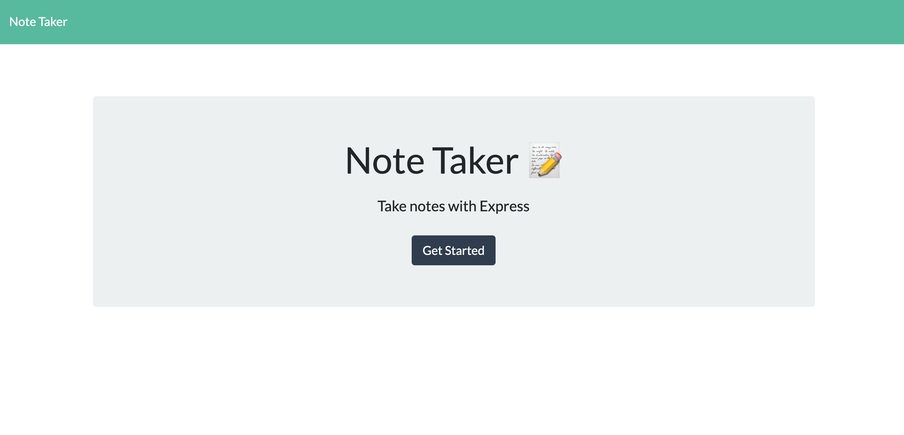
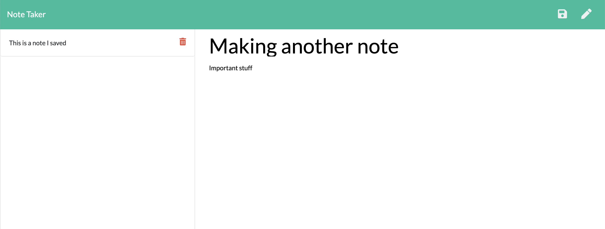

# Note_Pad

## Description
This is an application that allows you to create notes you need to save, review later, and delete once you have finished the tasks.

## Table of Contents

* [Title](#Title)

* [Description](##Description)

* [Links-to-project](##Links-to-project)

* [Installation](##Installation)

* [User-Story](##User-Story)

* [License](##License)

* [Contribution](##Contribution)  

* [Test](##Test)

* [Images](##Images)

* [Credits](##Credits)

* [Questions](##Questions)

## Links-to-project 
[Note_Pad](https://lauragwendolynburch.github.io/Note_Pad/)

[Github Repo](https://github.com/LauraGwendolynBurch/Note_Pad)

[Heroku App](https://tranquil-dawn-45425.herokuapp.com/)

## Installation
* NPM 
* node.js
* Heroku 
* nodemon

## License
[Apache License, Version 2.0](https://opensource.org/licenses/Apache-2.0)

## Contribution
Clone repo | Push changes | Create Pull request

## Image of project

## Image of project

## Credits
Anna Conover (tutor)

LevelApp (tutor)

University of Washington Bootcamp TAs and Instructor

Study Group: Aaron Parnell, Keenan Reed, Sally Perez, Rattanak Leng

## Questions
GitHub Username: [LauraGwendolynBurch](https://github.com/LauraGwendolynBurch)

Email: <lauraburch.lb@gmail.com>